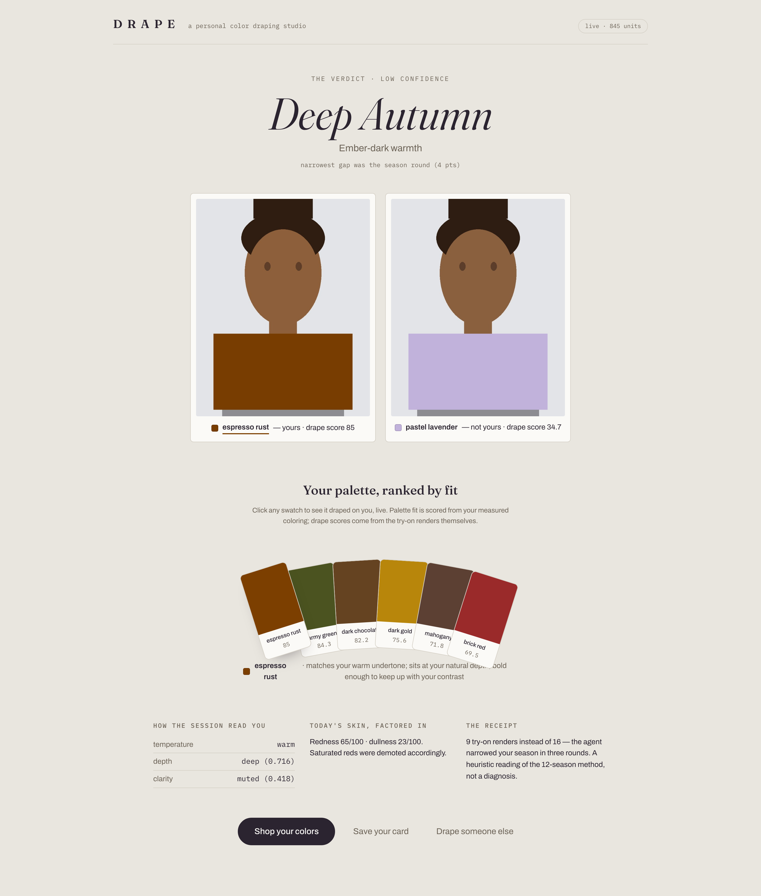
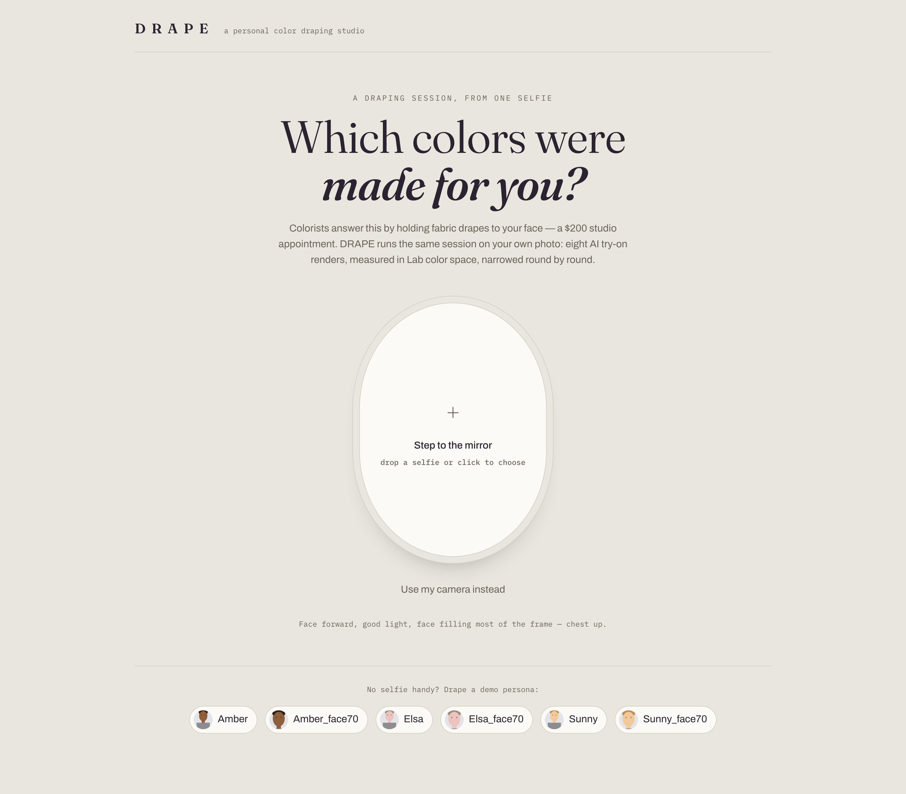
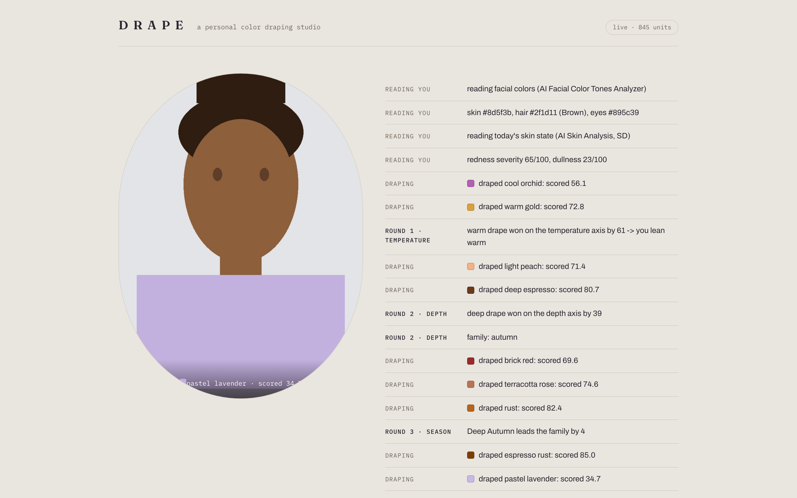
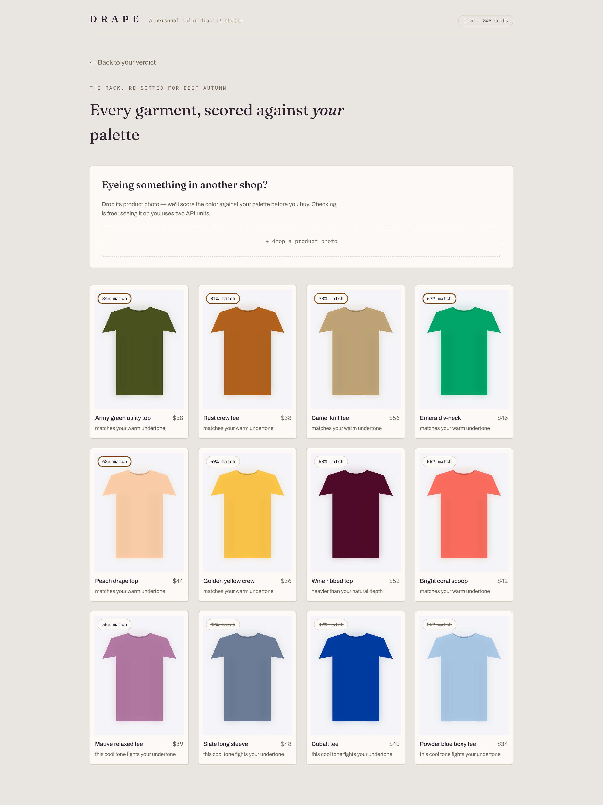

# DRAPE — an AI Personal Color Draping Studio

*Built for the YouCam API Skin AI & Apparel VTO Hackathon (Skin AI + Apparel VTO track).*

A personal color analysis ("12-season" draping session) costs $150–300 and a
studio appointment. DRAPE runs it from one selfie — and shows you the drapes
**on your own body** instead of holding fabric near your chin.



| | | |
|---|---|---|
|  |  |  |

*(Screenshots show the built-in demo personas; regenerate with
`node frontend/tools/screenshots.mjs` against running dev servers.)*

## How it works

An adaptive agent runs the session the way a human colorist does — probe,
observe, narrow — with the consultant's eye replaced by color math:

1. **AI Facial Color Tones Analyzer** reads skin/eye/eyebrow/lip/hair colors.
2. **AI Skin Analysis** (SD: redness + radiance) reads *today's* skin state.
3. **AI Clothes (cloth-v3)** renders test-color garments ("drapes") on the
   user's photo. A three-round decision tree (temperature → depth →
   sub-season) picks each next drape from prior scores: ~8 renders instead of
   16 naive, so the agent is also the unit-budget optimizer.
4. The harmony engine scores the **measured pixels of each render** (not the
   requested color — generative VTO can drift) against the face profile in
   CIELAB, and every score carries a plain-language reason.
5. Verdict: your season, ranked palette, confidence level, and a side-by-side
   best-vs-worst color reveal.

Ambiguous probes fall back to the face profile's own axis; if that's also
ambiguous, the session takes a neutral path and the verdict is capped at low
confidence. An honest "leaning warm, low confidence" beats a false certainty.

> **Honesty note:** this is a heuristic implementation of the 12-season
> draping method — a formalization of a subjective craft that human colorists
> themselves disagree about — not a clinically validated assessment. Axis
> thresholds and weights live at the top of `backend/drape/colorlab/scoring.py`.

## Accuracy

The classifier is calibrated against a **golden set of 36 season archetypes**
(3 per season, hexes encoding standard colorist descriptions — see
`backend/tests/fixtures/golden_archetypes.json`). Current measured accuracy,
enforced as regression tests:

| grain | accuracy | notes |
|---|---|---|
| temperature (warm/cool) | 100% | errors here are disqualifying |
| family (spring/summer/autumn/winter) | 100% | |
| exact sub-season | 92% | misses are adjacent seasons — the zone where human colorists also disagree |

Run `backend/scripts/calibrate.py -v` for the per-case table. Design choices
this process forced: round decisions compare **axis-specific score
components** (never totals, which leak cross-axis signal); depth probes are
lightness-matched so the pair's midpoint sits at the light/deep boundary;
sub-season ranking excludes the temperature component (constant within a
family) and leans on per-season axis targets. Selfie quality is gated before
any units are spent (`drape/api/photo_qc.py`): resolution, exposure, and
color-cast checks — a warm lamp shifts every skin reading warm.

## Repo layout

```
backend/
  drape/api/        YouCam client (upload → task → poll, disk cache, mock mode)
  drape/colorlab/   Lab conversion, 12-season model, harmony engine, render sampling
  drape/agent/      the adaptive draping session (deterministic decision tree)
  scripts/          drape wardrobe + persona + catalog generators (offline, zero API cost)
  app.py            FastAPI: sessions over HTTP, live trace polling, scored catalog
  cli.py            selfie → verdict in the terminal; day-1 live-API gate probes
  tests/            pytest suite; full pipeline runs offline in mock mode
frontend/           React (Vite): mirror upload → live session trace → verdict reveal
                    with swatch fan → shop ranked by match
```

## Run it

```bash
cd backend
python3 -m venv .venv && .venv/bin/pip install -r requirements.txt
.venv/bin/python scripts/make_drapes.py      # generate the drape wardrobe
.venv/bin/python scripts/make_personas.py    # synthetic test selfies

# offline, zero API units:
YOUCAM_MOCK=1 .venv/bin/python cli.py analyze assets/personas/amber.jpg --mock

# live (put YOUCAM_API_KEY in .env, see .env.example):
.venv/bin/python cli.py credit               # remaining units + per-feature costs
.venv/bin/python cli.py gate your_selfie.jpg # go/no-go probes: schema, costs, drape consistency
.venv/bin/python cli.py analyze your_selfie.jpg

.venv/bin/python -m pytest tests/            # 18 tests, all offline
```

Web app (two terminals, mock mode shown):

```bash
YOUCAM_MOCK=1 backend/.venv/bin/uvicorn app:app --app-dir backend --port 8321
npm install --prefix frontend && npm run dev --prefix frontend   # -> http://localhost:5321
```

## Deploy

Single Docker service; FastAPI serves the built frontend.

```bash
docker build -t drape . && docker run -p 8000:8000 -e YOUCAM_API_KEY=... drape
```

Or on Render: connect this repo (it reads `render.yaml`), set `YOUCAM_API_KEY`
in the dashboard, deploy. Public-deployment protections are on by default:
demo personas cost nothing, live upload sessions are capped per IP per day
(`DRAPE_LIVE_SESSIONS_PER_IP`), and the reserve floor stops spending before
the account empties.

Every API response is disk-cached by (image, feature, params): re-running a
pipeline on the same selfie costs 0 units.

## Unit budget (measured Jul 2026)

| call | units |
|---|---|
| AI Facial Color Tones Analyzer | 20 |
| AI Skin Analysis SD (1–4 concerns) | 9 |
| AI Clothes cloth-v3, per render | 2 |
| **full live session (~8 renders)** | **~45** |

Guard rails: demo personas always run on the offline mock engine (0 units,
even on a live deployment); live selfie sessions are refused when the account
would dip below the reserve floor (`DRAPE_UNIT_RESERVE`, default 150); the
masthead shows the live unit balance; failed tasks bill and then refund (net
zero -- confirmed in credit history), and the client always polls to
completion because *unpolled* successful tasks still bill.

## Live API findings (measured, day 1)

* **Drape consistency: GO.** Same crew-neck silhouette across recolored
  drapes; color drift deltaE 8-20 vs requested -- which is why the harmony
  engine scores the measured render pixels.
* **Face-size checks are stochastic near the boundary**: the same photo
  passed the 60%-width check once and failed it twice. Because failed tasks
  net zero, the session uses the API itself as the face detector: try full
  frame, retry with tighter center crops on `*_face_too_small` errors.
  Cloth try-on always keeps the original frame (it needs the shoulders).
* **The tone analyzer can misread hair badly on cropped photos** (black hair
  returned as pale blonde). Eyebrow lightness tracks natural hair depth, so
  a large hair/eyebrow disagreement swaps in the eyebrow reading.
* **Consistency check**: two independent live sessions on the same person
  (different framing paths, one containing the hair misread) converged on
  the same season verdict.

## API notes discovered the hard way

* Task failures return HTTP 200 with `task_status: "error"` — check the body.
* Declaring a file via the File API does **not** upload it; the PUT to the
  presigned URL is mandatory or tasks fail with `unknown_internal_error`.
* `file_id` is scoped to the feature it was uploaded for.
* `skin-tone-analysis` accepts **jpg only** and returns hex colors — there is
  no undertone field; DRAPE derives temperature from Lab b*/chroma itself.
* Skin-analysis scores: **higher = healthier** — "elevated redness" is a low
  redness score.
* Poll within the task retention window: unpolled tasks time out and still
  consume units on success.
* SD and HD skin concerns cannot be mixed in one request.
